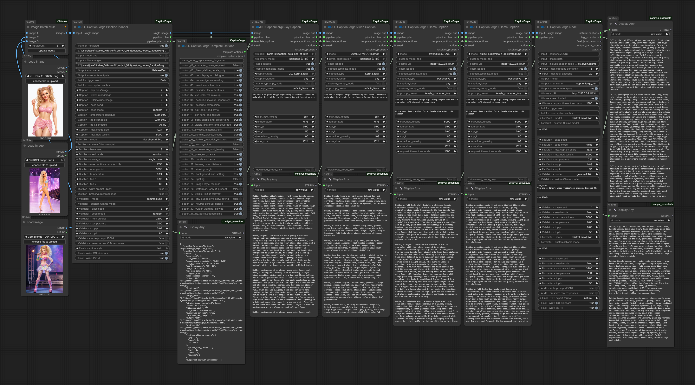

# CaptionForge

**Accurate, auditable image captions for LoRA dataset preparation in ComfyUI.**

CaptionForge is built around a simple idea: one captioner can be useful, but one captioner is also easy to fool. Instead of asking a single model to describe an image and hoping it gets everything right, CaptionForge can ask multiple independent captioning engines to produce separate “witness accounts” of the same image. Those accounts are then merged by a text-LLM distillation pass that looks for agreement, preserves useful details, and separates likely contradictions or unsupported claims. The resulting draft is checked against the image by a final vision-language model, which acts as the image-aware judge before the final captions are exported.

The goal is not magic, and it is not perfection. CaptionForge is meant for automated captioning of large image archives and LoRA training sets where hand-captioning would be too slow, but where the usual hallucinations, omissions, and inconsistencies from a single captioning model are still a problem. The pipeline is intentionally heavier than a normal caption node, so it is best used when caption quality, auditability, and consistency matter enough to justify the extra computation.

The current v0.1.x workflow is tuned primarily for character, fashion, portrait, doll/render, cosplay, pageant, glamour, and style-LoRA datasets, where visible details such as face, hair, eyes, expression, pose, body shape, clothing construction, accessories, colors, materials, lighting, background, framing, and visual style matter.

---

<p align="center">
  
  &nbsp;&nbsp;&nbsp;
  
</p>

[]()
[]()


## Starter workflow

A full workflow sample is included as a PNG with embedded ComfyUI workflow metadata:

```text
assets/workflows/CaptionForge_FullWorkflow.png
```

<p align="center">
  <a href="assets/workflows/CaptionForge_FullWorkflow.png">Download workflow PNG</a>
</p>

<p align="center">
  
</p>

A separate JSON export of the same workflow is also included:

```text
assets/workflows/CaptionForge_FullWorkflow.json
```

<p align="center">
  <a href="assets/workflows/CaptionForge_FullWorkflow.json">Download workflow JSON</a>
</p>

In ComfyUI, load the workflow by dragging either `CaptionForge_FullWorkflow.png` or `CaptionForge_FullWorkflow.json` onto the canvas.

## Install

Clone CaptionForge into your ComfyUI custom nodes folder:

```bash
git clone https://github.com/Damkohler/CaptionForge.git ComfyUI/custom_nodes/CaptionForge
```

Or copy the repository manually so the folder layout is:

```text
ComfyUI/custom_nodes/CaptionForge/
```

Then restart ComfyUI.

If your ComfyUI environment does not already include the needed Python packages, install CaptionForge dependencies from inside your ComfyUI Python environment. The exact command depends on how your ComfyUI install is managed, but typical options are:

```bash
cd ComfyUI/custom_nodes/CaptionForge
pip install -e .
```

or, if you maintain dependencies manually:

```bash
pip install torch transformers accelerate huggingface-hub pillow numpy safetensors qwen-vl-utils
```

Optional 8-bit loading may require:

```bash
pip install bitsandbytes
```

Ollama-backed stages require a working local Ollama installation and installed Ollama model tags.

Example:

```bash
ollama pull mistral-small:24b
ollama pull gemma4:26b
```

CaptionForge does **not** ship model weights. Joy, Qwen, and Ollama model downloads remain user-controlled.

## What the workflow does

CaptionForge's main pipeline is:

```text
Pass A — raw witness captions
  Joy Caption xN
  Qwen Caption xN
  optional Ollama VLM Caption xN

Pass B — text-LLM distillation
  combine witness captions
  preserve repeated and useful details
  separate contradictions and weak claims
  build a rich draft caption

Pass C — image-aware VLM validation
  inspect the actual image
  keep image-supported details
  remove unsupported hallucinations
  correct visible errors
  produce the authoritative long caption

Pass D — deterministic export formatting
  write the validated long caption
  derive a shorter LoRA-length caption
  derive a compact taggy caption
  write TXT and JSONL audit records
```

The important distinction is that the expensive semantic work should mostly end at the VLM-validated long caption. The short and taggy outputs are intentionally lighter recipe-style formatting steps derived from that validated caption, not new attempts to reinterpret the image.

## Current status

CaptionForge v0.1.0 is a working experimental preview for ComfyUI users and node developers who want to test a multi-pass captioning pipeline.

It is not presented as a universal replacement for a strong standalone captioner. If JoyCaption, Qwen, Florence, BLIP, WD14, or another captioning tool already gives you exactly what your dataset needs, you may not need CaptionForge. This project is aimed at cases where a single captioner is not accurate, complete, consistent, or auditable enough.

Expected v0.1.x realities:

- the workflow is computationally heavy
- large models may be slow
- model choices matter a lot
- output schemas may still evolve
- prompts and defaults may continue to be refined
- not every dataset will benefit equally
- comparison feedback is welcome

This is a heavy tool. Use it when the extra caption quality and audit trail of large automated jobs are worth the runtime cost.

## Why use this instead of a standalone captioner?

You may want CaptionForge when:

- one captioner notices the face but misses clothing details
- another captioner notices clothing but misreads the pose
- a third captioner catches style or material details the others miss
- you want an LLM to consolidate agreement instead of merely accepting one model's wording
- you want a final VLM to check the draft against the actual image
- you want intermediate JSONL records for debugging and audit
- you want final captions written as sidecars beside the source images
- you need both long natural captions and compact LoRA-style derivatives

The project question is practical:

> Can independent caption witnesses plus text distillation plus image-aware validation produce better dataset captions than a single captioning model alone?

For some datasets, the answer may be yes. For others, a simpler captioner may be enough. CaptionForge is designed to make that comparison visible.

## What CaptionForge tries to optimize

CaptionForge currently favors captions that are:

- rich enough for LoRA training
- visually grounded
- less hallucinated than unvalidated text-only synthesis
- explicit about visible, trainable details
- auditable through JSONL records
- locally runnable
- model-agnostic enough to improve as better captioners, distillers, and validators become available

Useful caption details often include:

- subject type and visible style
- face shape and facial traits
- hair color and hairstyle
- eye color and makeup as separate details
- expression and pose
- hands and body position
- body shape and visible proportions when relevant
- clothing construction, layers, fit, and materials
- accessories, jewelry, nails, props, and distinctive details
- colors, textures, lighting, background, framing, and crop

Visible glamour, swimwear, lingerie, revealing clothing, cleavage, side openings, exposed midriff, or similar styling may be described neutrally when it is actually visible and relevant to the dataset. CaptionForge prompts should not invent hidden anatomy, unseen clothing, explicit acts, or contradicted details.

## Active node families

Node categories are being normalized under:

```text
Captioning/CaptionForge
```

with active caption nodes under:

```text
Captioning/CaptionForge/Caption Nodes
```

### JLC CaptionForge Pipeline Planner

The central planning node for normal runs.

It coordinates:

- input image path or direct image passthrough
- recursive folder traversal
- filename glob filtering
- output directory
- run name
- overwrite behavior
- Pass A witness run counts
- seed schedules
- sampling schedules
- max image size
- max token budget
- LoRA trigger word
- user caption anchor
- distiller settings
- validator settings
- final export settings
- derived JSONL/TXT/config paths

### JLC CaptionForge

The main capstone/orchestration node.

It consumes Pass A raw caption records, runs the distillation and validation stages, and exports final captions. The VLM-validated natural paragraph is the authoritative long caption. Formatting stages should not blindly rewrite that natural caption.

### JLC CaptionForge Joy Caption

Python/Hugging Face JoyCaption/LLaVA-family Pass A witness.

Joy is treated as a first-class CaptionForge caption source and is often one of the strongest raw caption witnesses.

### JLC CaptionForge Qwen Caption

Python/Hugging Face Qwen-family Pass A witness.

Qwen is useful as a second independent captioning voice, especially when its behavior complements Joy. Optional 8-bit loading may be available where supported.

### JLC CaptionForge Ollama Caption

Ollama-backed VLM Pass A witness.

This node delegates image-caption generation to a local Ollama server rather than loading Hugging Face/PyTorch weights inside ComfyUI. It can use configured Ollama VLM tags such as:

```text
gemma4:26b
qwen3.6:35B-A3B
huihui_ai/gemma-4-abliterated:26b
```

Its purpose is to provide access to other raw-caption witness alternatives. It's function is parallel to the Joy Caption and Qwen Caption nodes, and should not be confused with the later VLM validator/capstone role.

### JLC CaptionForge Template Options

Shared prompt-option sidecar for caption nodes.

Template Options let one sidecar node feed consistent LoRA-relevant prompt modifiers into Joy, Qwen, Ollama, and later caption witnesses without duplicating the same option widgets on every caption node.

## Model and memory behavior

CaptionForge uses two model ecosystems:

1. **Python / Hugging Face model folders** for Joy and Qwen witness engines.
2. **Ollama models** for text-LLM distillation, image-aware VLM validation, optional formatting, and Ollama-backed caption witnesses.

Joy and Qwen use Python/Hugging Face engines that integrate with the CaptionForge process-local model cache. Those engines manage Python model residency, reuse, and eviction before loading heavyweight caption models.

Ollama-facing stages are different. Ollama models live in the Ollama daemon, not inside the CaptionForge Python model cache. Before handing work to Ollama, the Ollama Caption node and the CaptionForge capstone clear any resident CaptionForge Python/HF caption models if needed. After that handoff, Ollama owns Ollama model residency.

In short:

```text
Joy/Qwen engines:
  manage Python-hosted caption models through captionforge_model_cache

Ollama Caption and CaptionForge capstone:
  clear Python-hosted models before calling the Ollama daemon

Ollama daemon:
  owns Ollama model loading and residency
```

## Model locations

Large model weights are intentionally not stored in this repository.

Python-based witness models are expected under ComfyUI model folders, for example:

```text
ComfyUI/models/LLM/JLC_JoyCaption/
ComfyUI/models/LLM/JLC_QwenCaption/
```

Ollama models must be installed and runnable through Ollama outside this repository.

CaptionForge does not require every supported backend to be installed for every workflow. Users can test smaller subsets first.

## Ollama model dropdown configuration

The file:

```text
config/captionforge_ollama_models.json
```

defines user-editable Ollama model tags for dropdowns used by distiller, validator, formatter, and Ollama caption-witness nodes.

Example:

```json
{
  "distiller_models": [
    "mistral-small:24b",
    "VladimirGav/gemma4-26b-16GB-VRAM-Uncensored",
    "deepseek-r1:32b",
    "tarruda/neuraldaredevil-8b-abliterated:fp16",
    "gpt-oss:20b"
  ],
  "validator_models": [
    "gemma4:26b",
    "qwen3.6:35B-A3B",
    "huihui_ai/gemma-4-abliterated:26b"
  ],
  "format_models": [
    "mistral-small:24b",
    "VladimirGav/gemma4-26b-16GB-VRAM-Uncensored",
    "gpt-oss:20b",
    "deepseek-r1:32b"
  ],
  "caption_models": [
    "gemma4:26b",
    "qwen3.6:35B-A3B",
    "huihui_ai/gemma-4-abliterated:26b"
  ],
  "defaults": {
    "distiller_model": "mistral-small:24b",
    "validator_model": "gemma4:26b",
    "format_model": "mistral-small:24b",
    "caption_model": "gemma4:26b"
  },
  "include_custom": true
}
```

Terminology:

```text
distiller_model   text-only LLM for Pass B distillation
validator_model   image-aware VLM for Pass C validation
format_model      text-only LLM for formatting/taggy conversion when used
caption_model     Ollama-backed Pass A image-caption witness model
```

Values should be concrete Ollama model tags used exactly as written.

## Output layout

CaptionForge writes auditable run artifacts and final sidecars during planned runs.

A typical planned run uses this structure:

```text
<output_root>/
  opt_images/
    comfy_image_0000.png
    comfy_image_0000_long.txt
    comfy_image_0000_short.txt
    comfy_image_0000_taggy.txt
    comfy_image_0001.png
    comfy_image_0001_long.txt
    comfy_image_0001_short.txt
    comfy_image_0001_taggy.txt

  <run_name>__working/
    <run_name>__A_RAW_CAPTIONS.jsonl
    <run_name>__B_DISTILL.jsonl
    <run_name>__B_DISTILL_readable.jsonl
    <run_name>__B_DISTILL_readable.json
    <run_name>__B_DISTILL_prompts.jsonl
    <run_name>__C_VLM_VALIDATED.jsonl
    <run_name>__C_VLM_VALIDATED_readable/
    <run_name>__C_VLM_VALIDATOR_prompts.jsonl
    <run_name>__D_FINAL_EXPORT.jsonl
    <run_name>__output_paths.json
    <run_name>__run_config.json
```

Folder-input images keep their source locations, and final TXT sidecars are written beside those original images.

Optional direct `IMAGE` inputs are copied into a visible output-root folder:

```text
<output_root>/opt_images/
```

Final caption sidecars are written beside the resolved source image. For folder-input images, that means beside the original image. For optional direct images, that means beside the saved optional image inside `opt_images/`.

Final sidecars currently include:

```text
<image_stem>_long.txt
<image_stem>_short.txt
<image_stem>_taggy.txt
```

Meaning:

```text
_long.txt    the authoritative VLM-validated natural caption
_short.txt   a shorter LoRA-length caption derived from the long caption
_taggy.txt   a compact comma-separated taggy caption derived from the long caption
```

Long captions are intentional in v0.1.x. The current release-candidate strategy favors preserving visible, trainable detail in the validated long caption, then deriving shorter and taggy outputs from that result.

Exact JSONL schemas may evolve during the preview phase.

## Dependencies

Python dependencies are declared in `pyproject.toml` where applicable.

Typical local use may involve:

```text
torch
transformers
accelerate
huggingface-hub
pillow
numpy
safetensors
qwen-vl-utils
```

Optional quantization support may involve:

```text
bitsandbytes
```

Ollama-backed stages require a working local Ollama installation and installed Ollama model tags.

## Hardware notes

CaptionForge is designed for local workflows, but strong results may require large local models.

Practical performance depends on:

- GPU VRAM
- system RAM
- model size
- quantization mode
- Ollama version
- context length
- image size
- number of Pass A witness runs
- whether models are kept loaded or unloaded between runs

The author's active development environment includes an RTX 4090 Laptop GPU with 16 GB VRAM. Larger models may be slow, may require careful quantization, or may need more capable hardware.

## Experimental branches

Some experimental or unsupported code may exist in the repository for future A/B testing or research.

Experimental branches should be:

- clearly labeled
- kept out of the normal ComfyUI registration path
- not imported by `__init__.py`
- not shown as mainline nodes unless deliberately enabled
- treated as unsupported starting points rather than stable user features

The active public workflow should be the main Planner → Pass A witnesses → Distiller → VLM Validator → Export path.

## Development principles

CaptionForge currently prioritizes:

- local execution
- auditable intermediate records
- JSONL sidecars
- reusable engines separated from ComfyUI node wrappers
- planner-driven workflows
- model cache and VRAM hygiene
- strong defaults for LoRA captioning
- explicit prompt roles
- model-agnostic backends
- visible, trainable detail over generic caption prose
- practical feedback from real datasets

## Feedback wanted

Useful feedback includes:

- comparisons against standalone JoyCaption, Qwen, or other captioners
- examples where CaptionForge improves caption quality
- examples where CaptionForge makes captions worse
- hallucination reports
- missed-detail reports
- model recommendations
- prompt improvements
- broken node reports
- workflow usability feedback
- VRAM/performance observations
- JSONL/audit trail suggestions

Please include enough context to reproduce the issue or evaluate the result: selected nodes, model tags, relevant settings, whether the run used direct IMAGE input or a folder path, and a small sample of generated captions when possible.

## Attribution & License

Concept and implementation by **J. L. Córdova**, with development assistance from **ChatGPT (OpenAI)**.

CaptionForge's Joy/template-option workflow is locally adapted and was inspired in part by the practical template interface pattern used by the public JoyCaption Beta One Hugging Face Space:

```text
https://huggingface.co/spaces/fffiloni/JoyCaption-Beta-One
```

Copyright (c) 2026 J. L. Córdova

Released under the **MIT License**. See [`LICENSE`](./LICENSE) for details.
