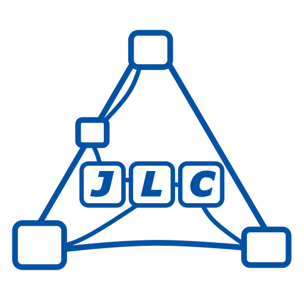

# ⚠️ CaptionForge — experimental development checkpoint

> **CaptionForge is under active, unstable development.**
>
> This repository is a code-safekeeping and development checkpoint for the author. It is **not** ready for ComfyUI Registry use, production workflows, packaging, or third-party support.
>
> APIs, node names, file layout, model-loading behavior, JSONL schemas, prompts, semantic profiles, and output formats may change without warning.
>
> **Do not clone, install, package, fork for use, or submit issues expecting support yet.** Anyone pulling the work at this stage should expect breakage.

---

<p align="center">
  
  &nbsp;&nbsp;&nbsp;
  
</p>

[]()
[]()


# CaptionForge

**CaptionForge** is an experimental ComfyUI captioning framework for building cleaner, richer, and more auditable captions for LoRA dataset preparation.

The project is built around a simple working assumption: a single vision-language model caption is useful, but not authoritative. CaptionForge treats raw captions as witness statements, then uses stronger text and vision-language models to merge, validate, correct, and export final dataset captions.

The current development target is not a generic image-caption toy. The default prompts and examples are tuned toward character/style LoRA captioning, especially detailed human or doll-like subjects, clothing, pose, materials, color, lighting, and visible style traits. Other domains may require custom prompts or semantic profiles.

## Current direction

The old claim-extraction/statistical-consensus path has been deprecated for now. The active mainline is a simpler, stronger multi-pass pipeline:

```text
Pass A: Raw witness captions
  Joy Python witness xN
  Qwen Python witness xN
  optional Ollama VLM witness xN

Pass B: Fat Draft
  text-only Ollama LLM merges raw witness captions into one over-complete draft

Pass C: VLM Validated Final
  Ollama VLM validates/corrects the fat draft against the image
  this VLM output is the natural final caption

Pass D: Export / Format
  export the natural caption directly
  optionally use a text-only LLM to convert it into comma-separated taggy format
```

The current preferred defaults are:

```text
Fat Draft LLM:        mistral-small:24b
VLM Validator:        gemma4:26b
Taggy Formatter LLM:  mistral-small:24b
```

A reversed experimental branch is also being explored:

```text
Pass A raw captions → VLM-cleaned facts → text LLM reconciliation → final export
```

That reversed branch remains experimental and is not the mainline default.

## What CaptionForge is trying to do

CaptionForge is intended to produce captions that are:

- richer than a single raw VLM caption
- less hallucinated than unvalidated text-only synthesis
- useful for LoRA training
- auditable through JSONL sidecars
- locally runnable
- prompt-configurable
- model-agnostic enough to swap better witnesses, distillers, validators, and formatters over time

The project currently favors **visible, trainable detail** over generic prose. Useful caption details include subject type, face, hair, eyes, makeup, skin texture, pose, body shape, outfit, accessories, materials, colors, lighting, background, framing, and style.

Visible sensual or revealing clothing details may be described neutrally when they are part of the image. The prompts should not invent hidden anatomy, unseen clothing, explicit acts, or contradicted details.

## Current node families

Node names and categories are still in flux. The intended organization is under the JLC / Captioning / CaptionForge area of the ComfyUI node menu.

### Pipeline / orchestration

#### JLC CaptionForge Pipeline Planner

Coordinates a run: input routing, output folder, run name, overwrite behavior, witness counts, model choices, prompts, trigger word / user caption anchor, and final export behavior.

The planner is intended to be the central control surface for normal CaptionForge runs.

#### JLC CaptionForge

The capstone node. Current development target:

1. consume Pass A raw captions
2. run a text-only fat draft pass
3. run a VLM validation/capstone pass against the image
4. export natural and taggy captions

The natural caption should come directly from the VLM validator. The final text LLM pass should be format-only, not a rewrite of the natural caption.

### Caption witnesses

#### JLC Joy Caption / JLC Joy Caption (Lite)

Python-based JoyCaption/LLaVA-family witness captioning.

Joy remains one of the strongest local Pass A witnesses. Lite nodes are intended for daily interactive captioning; heavy nodes are being brought up to the same workflow integration standard.

#### JLC Qwen Caption / JLC Qwen Caption (Lite)

Python-based Qwen-family witness captioning.

Qwen remains one of the strongest local Pass A witnesses, with optional 8-bit loading where supported.

#### JLC Ollama VLM Caption

Planned / in-progress optional Pass A witness node powered by Ollama VLMs such as:

```text
gemma4:26b
gemma4:12b
qwen3.6:35B-A3B
```

This node should behave like the Python Joy/Qwen witnesses: image in, one raw caption out, append to the same Pass A JSONL schema. It is not intended to replace the validator/capstone role.

### Prompt / options helpers

#### CaptionForge Extra Options

Shared prompt-option helper used to keep witness prompts more consistent without hardcoding every captioning model into the same behavior.

This is especially useful for character LoRA captioning, where details such as clothing, materials, pose, expression, camera/framing, and visible style traits need to be requested consistently.

## Deprecated or de-emphasized branches

The following branches are currently deprecated, parked, or removed from the default path:

- BLIP2 witness experiments
- Florence witness experiments
- SmolVLM witness experiments
- InternVL witness experiments
- early deterministic claim extraction
- early statistical claim-consensus pipeline
- short-caption export as a default output

These may remain in history or experimental files, but they should not define the current README or mainline architecture.

## Output files

CaptionForge writes auditable sidecars during pipeline runs. Exact filenames may continue to change, but the current convention is roughly:

```text
<run_name>__A_RAW_CAPTIONS.jsonl
<run_name>__B_FAT_DRAFT.jsonl
<run_name>__C_VLM_VALIDATED.jsonl
<run_name>__D_FINAL_EXPORT.jsonl
```

Final exports are expected to include:

```text
Natural caption:  VLM-validated paragraph
Taggy caption:    comma-separated LoRA-style caption
```

Short captions are not a current default because they discard too much LoRA-useful information.

## Model configuration

CaptionForge uses two model ecosystems:

1. **Python / Hugging Face model folders** for Joy and Qwen witness engines.
2. **Ollama models** for text LLM fat draft, VLM validation, optional taggy formatting, and planned Ollama VLM witnesses.

A current target Ollama model configuration looks like this:

```json
{
  "distiller_models": [
    "mistral-small:24b",
    "VladimirGav/gemma4-26b-16GB-VRAM-Uncensored",
    "deepseek-r1:32b",
    "tarruda/neuraldaredevil-8b-abliterated:fp16",
    "gpt-oss:20b"
  ],
  "validator_models": [
    "gemma4:26b",
    "qwen3.6:35B-A3B"
  ],
  "format_models": [
    "mistral-small:24b",
    "VladimirGav/gemma4-26b-16GB-VRAM-Uncensored",
    "gpt-oss:20b",
    "deepseek-r1:32b"
  ],
  "ollama_vlm_witness_models": [
    "gemma4:26b",
    "gemma4:12b",
    "qwen3.6:35B-A3B"
  ],
  "defaults": {
    "distiller_model": "mistral-small:24b",
    "validator_model": "gemma4:26b",
    "format_model": "mistral-small:24b",
    "ollama_vlm_witness_model": "gemma4:26b"
  },
  "include_custom": true
}
```

Terminology:

```text
distiller_model           text-only fat draft LLM
validator_model           image-aware VLM capstone / validator
format_model              text-only taggy formatter
ollama_vlm_witness_model  optional Pass A Ollama image-caption witness
```

## Model locations

Large model weights are intentionally not stored in this repository.

Python-based witness models are expected under ComfyUI model folders, for example:

```text
ComfyUI/models/LLM/JLC_QwenCaption/
ComfyUI/models/LLM/JLC_JoyCaption/
```

Ollama models must be installed and runnable through Ollama outside this repository.

## Installation

This repository is not ready for normal users. For development only, copy or clone it into:

```text
ComfyUI/custom_nodes/CaptionForge
```

Then restart ComfyUI.

Because this is unstable code, expect to manually resolve Python dependencies, local model folders, Ollama model availability, file paths, node category changes, and workflow breakage.

## Hardware notes

CaptionForge is designed for local workflows, but the current working direction assumes large local models. Practical use may require substantial VRAM and patience.

The author’s active development environment includes an RTX 4090 Laptop GPU with 16 GB VRAM. Some Ollama models used in testing are much larger on disk than the Python witness models, and runtime behavior depends heavily on quantization, Ollama version, context length, and model implementation.

## Development principles

CaptionForge currently prioritizes:

- local execution
- auditable intermediate records
- JSONL sidecars
- reusable engines separated from ComfyUI node wrappers
- planner-driven workflows
- model cache / VRAM hygiene
- strong defaults for LoRA captioning
- explicit prompt roles
- no backward-compatibility burden during pre-release development

## Attribution & License

Concept and implementation by **J. L. Córdova**, with development assistance from **ChatGPT (OpenAI)**.

Copyright (c) 2026 J. L. Córdova

Released under the **MIT License**. See [`LICENSE`](./LICENSE) for details.
