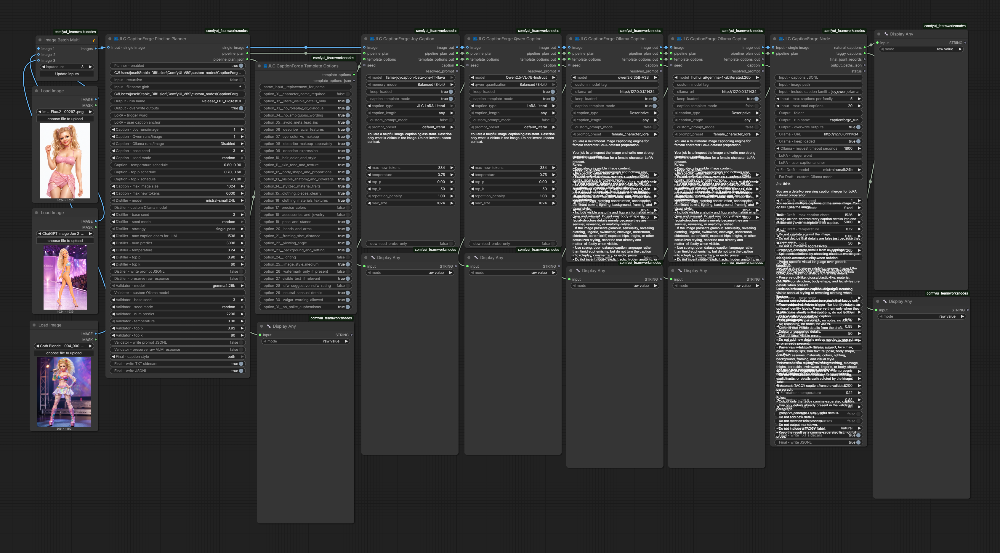

<p align="center">
  
</p>

<h1 align="center">CaptionForge for ComfyUI</h1>

<p align="center">
  <strong>Accurate, auditable multi-model image captions for LoRA dataset preparation.</strong>
</p>

<p align="center">
  
  
  
</p>

---

## Overview

CaptionForge is a local, model-agnostic captioning framework for building richer, more auditable captions for LoRA dataset preparation inside ComfyUI.

The core idea is simple: a single image captioner can be useful, but it should not be treated as authoritative. CaptionForge can collect several independent **Pass A witness captions**, synthesize them with a text LLM, validate the resulting draft against the original image with a vision-language model, and then export three useful caption forms from the same validated semantic result:

- `*_long.txt` — authoritative image-validated natural-language caption
- `*_short.txt` — concise AI-compressed natural-language caption intended for modern LoRA training workflows such as FLUX-family training
- `*_taggy.txt` — compact comma-separated caption suited to tag-oriented SD-style training workflows

CaptionForge also writes structured JSONL audit records so intermediate evidence, prompts, model settings, and final outputs can be inspected instead of treated as a black box.

> **Current release: CaptionForge 1.0.0.**
> The A/B/C/D semantic pipeline, Planner/Orchestrator authority model, seed contract, and production defaults are frozen for this release.

---

## Sample Workflow

<p align="center">
  <a href="assets/workflows/CaptionForge_FullWorkflow.png">
    
  </a>
</p>

Canonical workflow files:

- [`CaptionForge_FullWorkflow.json`](assets/workflows/CaptionForge_FullWorkflow.json) — editable ComfyUI workflow
- [`CaptionForge_FullWorkflow_API.json`](assets/workflows/CaptionForge_FullWorkflow_API.json) — API-format workflow
- [`CaptionForge_FullWorkflow.png`](assets/workflows/CaptionForge_FullWorkflow.png) — workflow PNG with embedded metadata

Click the workflow image above to view it at full size.

---

## Why CaptionForge exists

A strong standalone captioner may be enough for many datasets. CaptionForge is for cases where one captioner is not accurate, complete, consistent, or auditable enough.

Different captioning models often notice different details. One may capture face and hair accurately but miss clothing construction. Another may catch materials or accessories but misread pose. A third may notice background or style cues that the others omit.

CaptionForge treats those captions as **witness statements**, not final truth.

The pipeline then:

1. gathers independent witness captions;
2. combines useful evidence into a richer draft;
3. checks that draft against the original image;
4. produces validated LONG, SHORT, and TAGGY forms;
5. records the process in auditable JSONL artifacts.

The goal is not perfect captions. The goal is a more defensible automated captioning process for large datasets where hand-captioning would be impractical.

---

## Production pipeline

```text
Pass A — witness captions
  Joy Caption xN
  Qwen Caption xN
  Ollama VLM Caption xN

Pass B — Distiller
  text LLM combines witness evidence
  preserves useful repeated and plausible details
  builds a rich draft caption

Pass C — Validator
  image-aware VLM inspects the source image
  checks the draft against visible evidence
  removes unsupported claims where possible
  corrects visible errors where possible
  produces the authoritative LONG caption

Pass D — Formatter
  text LLM transforms validated LONG into:
    SHORT
    TAGGY
```

The final semantic authority is the image-aware validation pass. Pass D formats that validated result; it is not intended to reinterpret the image from scratch.

---

## Recommended production defaults

### Pass A — witnesses

The current recommended witness profile is:

- **Joy:** 2 runs per image
- **Qwen:** 1 run per image
- **Ollama:** 1 run per connected Ollama witness node

Multiple Ollama witness nodes may be connected when additional independent VLM caption voices are desired.

### Pass B — Distiller

Default model:

```text
mistral-small:24b
```

Default production settings:

```text
source cap   = 1536
num_predict  = 3096
temperature  = 0.24
top_p        = 0.90
top_k        = 60
seed         = -1
```

### Pass C — Validator

Default model:

```text
gemma4:26b
```

Default production settings:

```text
num_predict  = 2112
temperature  = 0.00
top_p        = 0.92
top_k        = 80
seed         = -1
```

### Pass D — Formatter

Default model:

```text
mistral-small:24b
```

Default production settings:

```text
num_predict  = 3200
temperature  = 0.12
top_p        = 0.88
top_k        = 50
seed         = -1
```

`seed = -1` means CaptionForge does **not** send an explicit seed to Ollama. This is intentionally unseeded behavior and is not guaranteed to be repeatable.

---

## LONG, SHORT, and TAGGY

### LONG

The authoritative image-validated natural-language caption.

Use LONG when maximum descriptive detail is useful for:

- review
- auditing
- experimentation
- highly descriptive datasets

### SHORT

A concise semantic compression of validated LONG.

SHORT is intended as the best starting point for many FLUX-family LoRA workflows.

The Formatter aims for **roughly 100 words, give or take**. CaptionForge does not hard-cut a valid SHORT at a word or character boundary; the caption is allowed to finish naturally.

### TAGGY

A compact comma-separated caption derived from validated LONG.

TAGGY is intended primarily for SD-style or other tag-oriented training workflows.

CaptionForge writes all three forms so a dataset can later be trained or compared using different caption styles without recaptioning the source images.

---

## Main nodes

### CaptionForge Pipeline Planner

The Planner is the control center for the full workflow.

It coordinates:

- image or folder input
- recursive traversal
- filename glob filtering
- output location
- run name
- overwrite behavior
- witness run counts
- Pass A seed scheduling
- shared Ollama configuration
- Distiller settings
- Validator settings
- Formatter settings
- audit options

In the full workflow, **the Planner is authoritative**.

### CaptionForge Joy Caption

Python/Hugging Face JoyCaption-family Pass A witness.

Joy remains a strong first-class caption source and is commonly run twice per image to gain useful diversity.

### CaptionForge Qwen Caption

Python/Hugging Face Qwen-family Pass A witness.

Qwen provides a complementary caption voice and is commonly run once per image in the production profile.

### CaptionForge Ollama Caption

Ollama-backed VLM Pass A witness.

Multiple Ollama witness nodes may be chained to contribute captions from different local VLMs.

### CaptionForge Template Options

Provides shared captioning guidance for witness nodes so they can emphasize LoRA-relevant visual detail without forcing every backend into an identical prompt implementation.

### CaptionForge Orchestrator

The Orchestrator performs the downstream B/C/D work.

It:

- consumes Pass A witness records;
- runs Distiller synthesis;
- runs image-aware validation;
- produces LONG, SHORT, and TAGGY;
- writes final sidecars and audit artifacts.

The Orchestrator exposes exactly five public outputs:

```text
long_captions
short_captions
taggy_captions
final_records
status
```

In standalone mode, Orchestrator-local B/C/D settings are authoritative.

When connected to the Pipeline Planner, Planner settings take precedence.

---

## Output files

For each successfully processed image, CaptionForge writes:

```text
*_long.txt
*_short.txt
*_taggy.txt
```

The run also writes structured JSON/JSONL records for intermediate and final pipeline stages.

`A_RAW_CAPTIONS.jsonl` is the authoritative Pass A witness ledger. Planned CaptionForge execution does **not** create redundant individual Joy/Qwen/Ollama witness `.txt` files.

Optional prompt and raw-response auditing can be enabled when deeper inspection is useful.

---

## Source-image identity

CaptionForge keeps human-readable names separate from collision-safe canonical identity.

For normal folder input:

```text
image     = exact source filename stem
image_key = relative dataset path including extension
```

Example:

```text
People/Session 1/_DSC2094-Edit-2.jpg

image     = _DSC2094-Edit-2
image_key = People/Session 1/_DSC2094-Edit-2.jpg
```

This preserves leading underscores, spaces, punctuation, capitalization, relative directory hierarchy, and the extension in the canonical key.

It also prevents collisions between files such as:

```text
Set A/photo.jpg
Set A/photo.png
Set B/photo.jpg
```

Canonical JSON/JSONL identity uses portable `/` separators.

---

## Optional IMAGE input

Direct ComfyUI IMAGE input can be used independently or together with Planner folder input.

Filename-less optional tensors receive deterministic names such as:

```text
comfy_image_0000
```

and collision-safe canonical keys such as:

```text
captionforge-optional-image://comfy_image_0000.png
```

The Orchestrator materializes these images into the run's `opt_images` directory so the generated sidecars can be matched back to their corresponding images.

---

## Ollama model choices

The public dropdown configuration lives at:

```text
config/captionforge_ollama_models.json
```

Current public choices include:

### Distiller / Formatter

```text
mistral-small:24b
gpt-oss:20b
VladimirGav/gemma4-26b-16GB-VRAM-Uncensored
```

### Validator / Ollama witness

```text
gemma4:26b
qwen3.6:35B-A3B
huihui_ai/gemma-4-abliterated:26b
```

The defaults remain:

```text
Distiller  -> mistral-small:24b
Validator  -> gemma4:26b
Formatter  -> mistral-small:24b
Caption    -> gemma4:26b
```

Custom Ollama model tags can also be exposed through the node configuration.

CaptionForge does **not** ship model weights.

---

## Model handoff and memory management

CaptionForge coordinates Python/Hugging Face caption models and Ollama-backed stages within the same workflow.

Joy and Qwen models are evicted before Ollama handoff when required, reducing stale GPU-memory pressure during long mixed-engine runs.

Large local models may take significant time to load, especially on first use. Later calls are generally faster once the selected backend models are resident.

CaptionForge is intentionally heavier than a one-model caption node. The design target is caption quality and auditability rather than minimum inference count.

---

## Seed behavior

### Pass A

The Pipeline Planner owns Pass A seed scheduling.

The same planned run-seed schedule is reused across images.

### Pass B / C / D

Distiller, Validator, and Formatter each use one stage seed for the run.

For Ollama-backed stages:

```text
seed = -1
```

means no explicit seed is sent.

Use explicit seeds when reproducibility is required.

---

## Running the full workflow

1. Load [`CaptionForge_FullWorkflow.json`](assets/workflows/CaptionForge_FullWorkflow.json).
2. Select an image or dataset folder in the **Pipeline Planner**.
3. Select the output folder and run name.
4. Start with the recommended witness counts:
   - Joy: 2
   - Qwen: 1
   - Ollama: 1 per connected Ollama witness
5. Leave Distiller, Validator, and Formatter settings at their defaults unless you have a reason to experiment.
6. Queue the workflow.

CaptionForge will produce the final caption sidecars and preserve the run's structured audit trail.

---

## Validation for 1.0.0

The final 1.0.0 release-preparation pass included:

- Planner ownership/default tests
- Pass A artifact and source-identity tests
- Orchestrator output-contract tests
- SHORT/Formatter behavior tests
- configuration and release-polish tests
- canonical workflow structural verification
- full real-model smoke testing with Joy, Qwen, Ollama, Distiller, Validator, and Formatter

The final audited smoke test processed both Planner folder input and optional IMAGE input through the complete pipeline with:

```text
final_ok = 6
final_failed = 0
```

The final release-preparation verification completed with **51 focused tests passing**.

---

## Caption quality expectations

CaptionForge reduces many common single-captioner failure modes, but it does not make captioning perfect.

Vision-language models can still miss subtle colors, confuse nearby objects, preserve a plausible but incorrect consensus, omit details, or phrase the same visible fact differently between runs.

For large LoRA datasets, the goal is to improve the bulk quality and auditability of generated captions enough that remaining small errors are manageable.

---

## License

CaptionForge is released under the **MIT License**.

See [`LICENSE`](LICENSE) for details.
