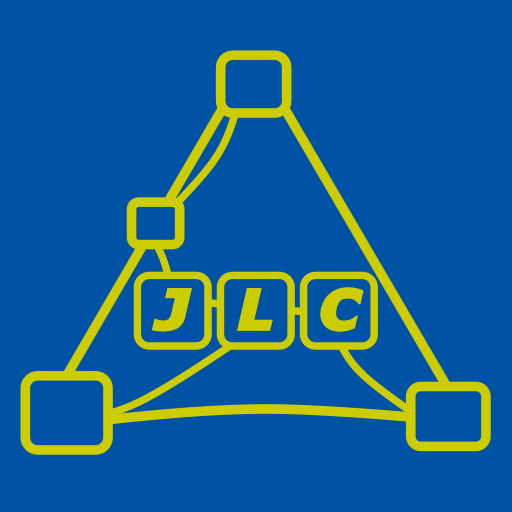

# CaptionForge

**Accurate, auditable image captions for LoRA dataset preparation in ComfyUI.**

CaptionForge is a local, model-agnostic captioning framework built around a simple idea: a single image captioner can be useful, but it should not be treated as authoritative.

CaptionForge can collect several independent **Pass A witness captions**, synthesize them with a text LLM, validate the result against the original image with a VLM, and then export three useful caption forms from the same validated semantic result:

- **`*_long.txt`** — authoritative image-validated natural-language caption
- **`*_short.txt`** — AI-compressed natural-language caption intended for modern LoRA training workflows such as FLUX-family training
- **`*_taggy.txt`** — compact comma-separated caption suited to tag-oriented SD-style training workflows

CaptionForge also writes JSONL audit records so intermediate evidence, prompts, model settings, and final outputs can be inspected rather than treated as a black box.

> **Current release:** **CaptionForge 1.0.0.** The A/B/C/D semantic pipeline, Planner/Orchestrator authority model, seed contract, and production defaults are frozen for this release.

---

<p align="center">
  
  &nbsp;&nbsp;&nbsp;
  
</p>

[]()
[]()


---

## Why CaptionForge exists

Different captioning models often notice different parts of the same image.

One may describe the face well but miss garment construction. Another may notice materials or accessories but misread the pose. A third may catch scene or style details that the others omit. CaptionForge treats these captions as **witness statements**, not final truth.

The production pipeline separates those roles deliberately:

```text
Pass A — Witnesses
    independent visual observations

Pass B — Distiller
    synthesize witness evidence into a rich draft

Pass C — Validator
    inspect the actual source image and correct the draft

Pass D — Formatter
    derive SHORT and TAGGY forms from the validated LONG caption
```

The image-aware Pass C result is the semantic authority. Pass D does not reinterpret the image; it reformats already validated information.

CaptionForge is intentionally heavier than a single caption node. It is most useful when caption quality, consistency, and auditability justify the extra compute.

---

# Production pipeline

## Pass A — independent caption witnesses

CaptionForge currently supports three production witness families:

- **Joy Caption** — Python / Hugging Face
- **Qwen Caption** — Python / Hugging Face
- **Ollama VLM Caption** — local Ollama-backed witness

Current production Planner defaults:

```text
Joy runs/image:     2
Qwen runs/image:    1
Ollama runs/image:  1
```

These defaults came from fixed-corpus testing. A second Joy sample frequently added useful evidence, while repeated Qwen runs showed much stronger diminishing returns and more formatting/contradiction noise. A third run of either family was not cost-effective in the study corpus.

Pass A captions are **evidence**, not final captions.

### Pass A seed behavior

In planned mode, the Pipeline Planner owns the Pass A seed schedule:

- one base seed + one seed mode define the N-run sequence
- the same N-seed schedule is reused for every image
- image ordinal does not modify the sequence
- fixed / increment / decrement schedules are deterministic
- random mode is deterministic and hash-derived
- `-1` means intentionally unseeded

Standalone Joy, Qwen, and Ollama caption nodes accept an optional seed input. If no seed is connected, generation is intentionally unseeded.

---

## Pass B — text-LLM distillation

Pass B receives the raw witness captions for one image and builds a rich draft.

Production default model:

```text
mistral-small:24b
```

The distiller is text-only. It is expected to:

- reconcile multiple witness descriptions
- preserve useful repeated details
- retain plausible singleton details for later visual checking
- avoid treating one witness as automatically authoritative
- produce a rich draft for the image-aware Validator

The production implementation is in the main CaptionForge node path; older standalone distiller prototypes are retained only as reference/experimental code.

---

## Pass C — image-aware VLM validation

Pass C is the semantic authority of the pipeline.

Production default model:

```text
gemma4:26b
```

The Validator receives the Pass B draft **and the source image**. It is expected to:

- inspect the actual image
- retain supported details
- remove unsupported claims
- correct visible errors
- preserve useful LoRA-training information
- produce the authoritative natural-language final caption

That result becomes **`*_long.txt`**.

---

## Pass D — SHORT + TAGGY formatting

Production default model:

```text
mistral-small:24b
```

Pass D receives the already validated Pass C paragraph and produces both:

```text
SHORT: <concise natural-language caption, at most 90 words>
TAGGY: <compact comma-separated caption>
```

### SHORT

`*_short.txt` is **AI semantic compression**, not deterministic truncation.

The formatter is instructed to preserve useful information across the whole validated caption, including where present:

- subject and defining identity traits
- face / hair / body traits
- major clothing pieces and materials
- pose and action
- accessories and unusual details
- setting
- lighting
- framing
- visual medium / style

The default prompt explicitly tells the model to **compress wording, not category coverage** and not merely copy the beginning of the source caption.

For FLUX-family LoRA training, `_short` is the recommended default CaptionForge export.

### TAGGY

`*_taggy.txt` is also generated by Pass D, then deterministically normalized/compacted.

It is intended for tag-oriented training workflows such as traditional SD-family captioning pipelines.

Fixed-corpus testing found the current taggy path compact and semantically faithful enough that no redesign was justified before 1.0.

---

# Planner and Orchestrator ownership

CaptionForge has two complementary control surfaces.

## Pipeline Planner

The **Pipeline Planner** is the authoritative project-level controller in a full workflow.

It owns:

- input/folder routing
- output routing
- run name and overwrite behavior
- Pass A witness counts and seed schedule
- Pass B Distiller controls
- Pass C Validator controls
- Pass D Formatter controls
- shared Ollama connection / keep-alive / timeout behavior
- audit/preservation policy
- final output policy

## CaptionForge / Orchestrator

The **CaptionForge Orchestrator** is fully capable of standalone B/C/D operation.

A useful mental model is:

```text
Orchestrator = principal engineer
Planner  = project leader
```

The Orchestrator keeps complete local controls so it can be used independently.

When a Planner is connected:

```text
Planner values override corresponding Orchestrator values.
```

For every shared Pass B/C/D semantic control, current production defaults are aligned between Planner and Orchestrator.

---

# Current production defaults

## Shared Ollama

```text
URL:          http://127.0.0.1:11434
keep loaded:  true
timeout:      1800 s
```

## Pass B — Distiller

```text
model:                  mistral-small:24b
custom model:           blank
source caption cap:     1536 characters
num_predict:            3096
temperature:            0.24
top_p:                  0.90
top_k:                  60
default seed:           unseeded
prompt audit:           false
raw response preserve:  false
```

## Pass C — Validator

```text
model:                  gemma4:26b
custom model:           blank
num_predict:            2112
temperature:            0.00
top_p:                  0.92
top_k:                  80
default seed:           unseeded
prompt audit:           false
raw response preserve:  false
```

## Pass D — Formatter

```text
model:                  mistral-small:24b
custom model:           blank
num_predict:            3200
temperature:            0.12
top_p:                  0.88
top_k:                  50
default seed:           unseeded
prompt audit:           false
raw response preserve:  false
```

These values are based primarily on the configuration that produced the successful six-image extended smoke test used during final 1.0 release polish.

---

# Outputs

A normal planned run can produce:

```text
<image>_long.txt
<image>_short.txt
<image>_taggy.txt
```

as well as run-level audit files.

The final export JSONL carries all three caption forms together per image.

Typical audit/output artifacts include:

```text
<run_name>__A_RAW_CAPTIONS.jsonl
<run_name>__B_DISTILL.jsonl
<run_name>__C_VLM_VALIDATED.jsonl
<run_name>__D_FORMAT_TAGGY.jsonl
<run_name>__D_FINAL_EXPORT.jsonl
<run_name>__output_paths.json
```

The Planner also returns the complete run configuration as JSON through its `pipeline_plan_json` output. Model-specific standalone Pass-A nodes can write timestamped run-config JSON files during planned folder runs. Optional prompt and raw-response audit artifacts are written when the corresponding controls are enabled.

---

# Which final caption should I train with?

| Output | Recommended use |
|---|---|
| `_long.txt` | audit, inspection, maximum descriptive fidelity |
| `_short.txt` | **default for FLUX-family / natural-language LoRA training** |
| `_taggy.txt` | **tag-oriented SD-family LoRA training** |

The choice still depends on trainer, base model, dataset, trigger strategy, and training objective. CaptionForge deliberately exports all three so you do not have to destroy information to change training style later.

---

# Canonical workflow

Canonical workflow assets:

```text
assets/workflows/CaptionForge_FullWorkflow.json
assets/workflows/CaptionForge_FullWorkflow_API.json
assets/workflows/CaptionForge_FullWorkflow.png
```

The PNG contains embedded ComfyUI workflow metadata and can be dragged directly into ComfyUI.

The JSON, API JSON, and embedded PNG workflow are maintained as synchronized artifacts.

---

# Main node families

In ComfyUI, Planner/Orchestrator/support nodes appear under `Caption/CaptionForge`; witness nodes appear under `Caption/CaptionForge/Caption Nodes`.

### `JLC CaptionForge Pipeline Planner`

Central control surface for a planned CaptionForge run.

### `JLC CaptionForge Orchestrator`

Orchestrator/coordination node implementing production Pass B, C, and D behavior.

### `JLC CaptionForge Template Options`

Shared Pass A prompt-option sidecar used to request consistent LoRA-relevant visual detail without forcing every witness backend to use the same internal prompt implementation.

### `JLC CaptionForge Joy Caption`

JoyCaption/LLaVA-family Pass A witness.

### `JLC CaptionForge Qwen Caption`

Qwen-family Pass A witness.

### `JLC CaptionForge Ollama Caption`

Ollama-backed Pass A VLM witness.

Experimental engines/nodes may exist in explicitly marked experimental paths, but they do not define the production pipeline.

---

# Model ecosystems

CaptionForge uses two local model ecosystems.

## Python / Hugging Face

Joy and Qwen witness models are loaded inside the ComfyUI Python process.

Typical local model roots include:

```text
ComfyUI/models/LLM/JLC_JoyCaption/
ComfyUI/models/LLM/JLC_QwenCaption/
```

CaptionForge includes conservative model-cache / eviction behavior to reduce accidental heavyweight Python-model co-residency on limited-VRAM systems.

## Ollama

Pass B, Pass C, Pass D, and optional Ollama witnesses communicate with a local Ollama server.

Default URL:

```text
http://127.0.0.1:11434
```

Before an Ollama handoff, CaptionForge can evict resident Python/Hugging Face witness models so the two model ecosystems do not unnecessarily compete for VRAM.

---

# Ollama model configuration

User-editable dropdowns are configured through:

```text
config/captionforge_ollama_models.json
```

Roles:

```text
distiller_model   -> Pass B text LLM
validator_model   -> Pass C image-aware VLM
format_model      -> Pass D text LLM
caption_model     -> optional Pass A Ollama VLM witness
```

Values are concrete Ollama model tags and must exist in the user's local Ollama installation.

CaptionForge does not ship model weights.

---

# Installation

Clone CaptionForge into the ComfyUI custom-nodes directory:

```bash
cd ComfyUI/custom_nodes
git clone https://github.com/Damkohler/CaptionForge.git
```

Install the project into the same Python environment that runs ComfyUI, then restart ComfyUI:

```bash
cd CaptionForge
python -m pip install -e .
```

For a portable ComfyUI build, replace `python` with that installation's embedded Python executable. The optional `bitsandbytes` dependency is only needed for compatible quantized Hugging Face configurations:

```bash
python -m pip install -e ".[quantization]"
```

Ollama-backed stages require a working local Ollama installation and configured model tags, for example:

```bash
ollama pull mistral-small:24b
ollama pull gemma4:26b
```

Python/Hugging Face witnesses may also require packages such as:

```text
torch
transformers
accelerate
huggingface-hub
pillow
numpy
safetensors
qwen-vl-utils
bitsandbytes   # optional / configuration-dependent
```

The editable project install supplies the required Python packages. When model download is enabled, missing Hugging Face weights are downloaded on first use and cached locally; CaptionForge itself does not bundle weights.

## First run

1. Start Ollama and confirm the selected model tags are installed.
2. Restart ComfyUI after installing CaptionForge.
3. Drag `assets/workflows/CaptionForge_FullWorkflow.png` onto the ComfyUI canvas, or load the canonical JSON workflow.
4. In the Pipeline Planner, choose the image file/folder, output folder, and run name. Keep the validated defaults for a first run.
5. Queue the workflow. Use `_short.txt` for most FLUX-family/natural-language LoRA training, `_taggy.txt` for tag-oriented SD-style training, and `_long.txt` for maximum detail or review.

---

# Hardware notes

CaptionForge is designed for local inference, but the production workflow uses substantial models.

The main development and release-validation environment has included:

```text
NVIDIA RTX 4090 Laptop GPU
16 GB VRAM
```

This is a reference environment, not a stated minimum.

Runtime and memory behavior depend on selected models, quantization, image dimensions, token budgets, Ollama model size, GPU VRAM, system RAM, and local software versions.

---

# Auditability

Depending on enabled controls, a run can preserve:

- raw Pass A captions
- model family
- run index
- seed
- generation parameters
- prompts
- raw LLM/VLM responses
- Pass B drafts
- Pass C validated captions
- Pass D SHORT / TAGGY output
- final LONG / SHORT / TAGGY exports
- run configuration
- output path manifest

Audit controls are optional because retaining every prompt and raw response can create substantial output volume.

---

# Design principles

CaptionForge 1.0 is guided by a few practical principles:

- **multiple witnesses are evidence, not authority**
- **the image-aware Validator is the final semantic authority**
- **SHORT and TAGGY derive only from validated content**
- **Planner controls the full workflow; Orchestrator remains fully capable standalone**
- **seed behavior should be explicit and reproducible**
- **auditability matters**
- **local execution matters**
- **successful caption semantics take priority over architectural elegance**

CaptionForge is not intended to solve every possible captioning domain through a universal ontology. Its prompts are currently tuned most strongly toward character, portrait, fashion, render/doll, cosplay, glamour, and style-oriented LoRA datasets, but the pipeline is model- and prompt-configurable.

Visible details may be described neutrally when relevant to the image. The pipeline should not invent unseen anatomy, hidden clothing, backstory, explicit acts, or details contradicted by the source image.

---

# Validation status for 1.0.0

CaptionForge 1.0.0 release validation included:

- fixed-corpus LONG / SHORT / TAGGY quality analysis
- replacement of deterministic SHORT truncation with AI semantic compression
- witness-diversity testing on a fixed 19-image corpus
- production Pass-A defaults selected as `2 Joy / 1 Qwen / 1 Ollama`
- downstream Planner ↔ Orchestrator ownership reconciliation
- B/C/D production-default parity
- seed-contract hardening
- canonical JSON / API JSON / PNG synchronization
- workflow widget-order regression coverage
- CPU contract tests
- Python compilation checks
- Ruff correctness checks on changed production files
- real ComfyUI smoke testing
- independent loading of canonical JSON and PNG workflows in separate ComfyUI instances

The semantic caption pipeline is considered frozen for the 1.0 release unless further testing reveals a concrete defect.

The fixed-corpus downstream formatting study is preserved in [`docs/quality-study-2026-09.md`](docs/quality-study-2026-09.md).

---

# Development / experimental code

Experimental or historical implementations may remain under explicitly marked local paths such as:

```text
nodes/experimental/
engines/experimental/
.backups/
```

These paths are not registered or shipped as production packages. Older standalone Distiller/Validator implementations at the root of `engines/` are reference/CLI code and are not the authoritative production B/C/D implementation.

The authoritative downstream production path is coordinated by:

```text
nodes/jlc_captionforge_node.py
```

---

# Attribution

Concept and implementation by **J. L. Córdova**, with development assistance from **ChatGPT (OpenAI)**.

Designed for use with:

```text
https://github.com/comfyanonymous/ComfyUI
```

Repository:

```text
https://github.com/Damkohler/CaptionForge
```

---

# License

Copyright (c) 2026 J. L. Córdova

Released under the **MIT License**. See [`LICENSE`](./LICENSE) for details.
